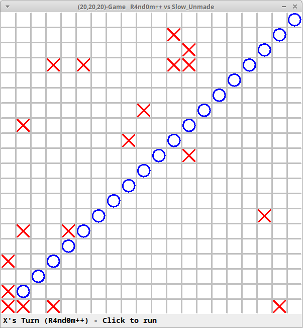
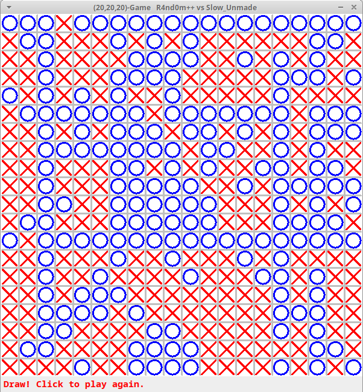

- [MNKGame](#mnkgame)
  - [Compilation](#compilation)
  - [Execution](#execution)
    - [Legend](#legend)
    - [Game modes](#game-modes)
    - [Utils](#utils)
      - [MNKPlayerTester application](#mnkplayertester-application)
  - [Instances examples](#instances-examples)
    - [`java -cp ".." mnkgame.MNKGame 20 20 20 mnkgame.QuasiRandomPlayer subroutine.GroupPlayer`](#java--cp--mnkgamemnkgame-20-20-20-mnkgamequasirandomplayer-subroutinegroupplayer)
      - [First moves](#first-moves)
      - [Final result](#final-result)

# MNKGame

Project of the course of algorithms of data structures.

## Compilation

1. Clone the repository

2. Command line compilation:
   ```
   cd MNKGame/mnkgame
   javac -cp ".." *.java
   cd ../subroutine/
   javac -cp ".." *.java
   ```

## Execution

Go to the path: `MNKGame/mnkgame/`

### Legend

- `M` is the number of the rows;
- `N` is the number of the columns;
- `K` is the number of the symbols to juxtapose;
- `P` can be one of:
  - `mnkgame.RandomPlayer` (a weak bot developed by the professor)
  - `mnkgame.QuasiRandomPlayer` (a strong bot developed by the professor)
  - `subroutine.GroupPlayer` (the bot developed by us)

### Game modes

- Human vs Computer (where `P` is the bot player):

  `java -cp ".." mnkgame.MNKGame M N K P`

- Computer vs Computer:

  `java -cp ".." mnkgame.MNKGame M N K P P`

### Utils

#### MNKPlayerTester application

- Output score only:

  `java -cp ".." mnkgame.MNKPlayerTester M N K P P`

- Verbose output:
  `java -cp ".." mnkgame.MNKPlayerTester M N K P P -v`
- Verbose output and customized timeout (1 sec) and number of game repetitions (10 rounds):

  `java -cp ".." mnkgame.MNKPlayerTester M N K P P -v -t 1 -r 10`

- Note that you can customize the use of:

  `-v`, `-t`, `number`, `-r`, `number`

## Instances examples

### `java -cp ".." mnkgame.MNKGame 20 20 20 mnkgame.QuasiRandomPlayer subroutine.GroupPlayer`

#### First moves



#### Final result


